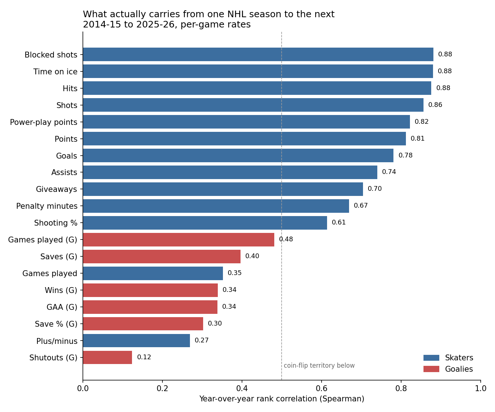

# fantasy-hockey-draft

A draft board built on what's actually predictable, not on what happened last year.

```bash
python3 -m pip install -r requirements.txt
python3 scripts/analyze_predictability.py --out out/
```

Pulls 12 NHL seasons from the league's public stats API, caches them, and
measures how much of each stat carries from one season to the next.

## The finding



Twelve seasons (2014-15 through 2025-26), 10,999 skater-seasons and 1,177
goalie-seasons, per-game rates, Spearman rank correlation between consecutive
seasons.

### Every goalie stat is less predictable than almost every skater stat

| stat | year-over-year ρ |
|---|---|
| Skater points | **0.81** |
| Goalie save % | **0.30** |
| Goalie wins | 0.34 |
| Goalie shutouts | 0.12 |

Skater points are about **2.7× more predictable** than goalie save percentage.
The *most* predictable thing about a goalie — how many games they play, at 0.48
— is still less predictable than the *tenth* most predictable skater stat.

"Wait on goalies" is folk wisdom. This is the number behind it.

**The obvious objection is sample size**, since a lot of those goalies are
backups with 15 games. It survives:

| min games | pairs | save % ρ |
|---|---|---|
| 10 | 638 | 0.313 |
| 30 | 341 | 0.365 |
| 50 | 105 | 0.425 |

Restricting to workhorse starters lifts it from 0.30 to 0.43 — so sample size
explains part of the gap, but not most of it. Skater points at the same
threshold sit at 0.835.

### The "boring" stats are the reliable ones

| stat | ρ |
|---|---|
| Blocked shots | 0.88 |
| Time on ice | 0.88 |
| Hits | 0.88 |
| Shots | 0.86 |
| Power-play points | 0.82 |
| **Points** | **0.81** |
| Goals | 0.78 |
| Assists | 0.74 |

Hits, blocks and shots are **more** predictable than points. They're driven by
role and deployment, which change slowly, while scoring carries finishing luck.
In a categories league the peripheral columns are the ones you can actually
bank on.

### Two things nobody should pay for

**Plus/minus (0.27)** is close to noise. It depends on teammates, goaltending
and on-ice shooting percentage — almost none of which is the player.

**Games played (0.35).** Durability is far less predictable than draft-day
conversation assumes. "He's injury prone" carries much less signal than "he
plays 20 minutes a night" (time on ice, 0.88).

### One nuance worth stating honestly

Shooting percentage lands at **0.61**, higher than the usual "it all regresses"
line suggests. That isn't a contradiction: this measures whether *rankings*
persist, and genuine snipers really do out-shoot the field year after year.
The regression-to-mean claim is about a player's deviation from *their own*
baseline, which is a different question than the one measured here.

## Why this is the right question for a draft

A stat you can't predict is one you shouldn't pay for, however good it looked
last season. The ordering above is what a value model should weight — and it's
the input to the next stage of this project, a value-over-replacement draft
board that re-ranks live as picks come off the board.

## Method

Four choices, each of which changes the answer:

- **Per-game rates, not totals.** Totals confound production with
  availability, and 2019-20 and 2020-21 were 68 and 56 games — raw totals
  aren't comparable across that boundary. Games played is measured separately
  instead, since durability is its own fantasy skill.
- **Spearman, not Pearson.** Drafting is an ordering problem, and rank
  correlation survives the outliers that a few elite scorers would otherwise
  dominate.
- **A minimum-games threshold on both seasons.** Without one, four games of
  fluke shooting sits beside an 82-game regular.
- **Only genuinely consecutive seasons.** A player who misses a year and
  returns is evidence about something else; folding them in would understate
  every stat.

### One bug worth recording

The first version of the data pull returned 924 rows for a season carrying only
917 distinct players. Offset pagination over an **unstable sort** silently
returns some rows twice and drops others — seven duplicated, seven lost. Fixed
by sorting on `playerId`, and `fetch_report` now checks for repeats explicitly,
because the duplicate is the visible half of a bug whose other half is missing
data.

## Layout

```
fantasy/nhl.py             pull and cache season stats from the NHL API
fantasy/predictability.py  year-over-year persistence, measured honestly
scripts/analyze_predictability.py   run it, write the tables and the chart
```

Data is cached to `data/raw/` on first run so the analysis is reproducible —
a stat that shifts between runs is an anecdote, not a measurement.

## Source

NHL public stats API (`api.nhle.com/stats/rest/en`). No key required.
